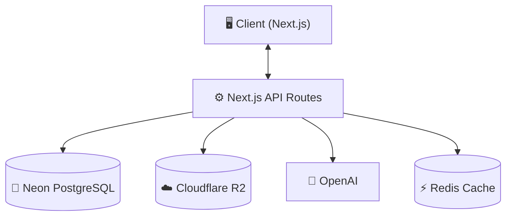
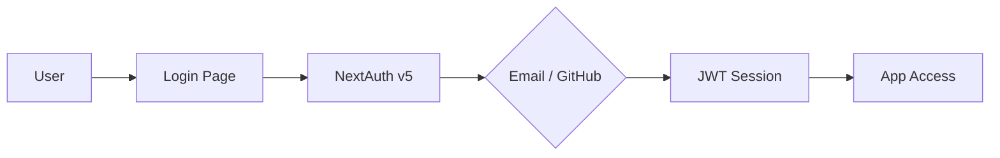
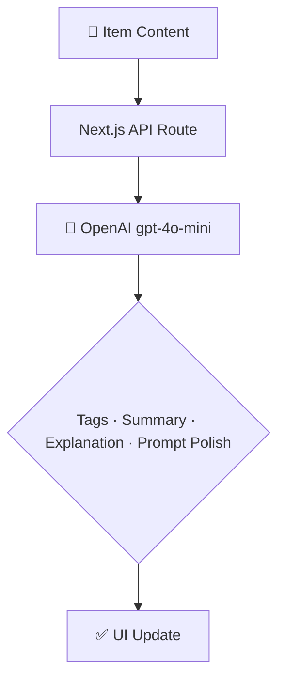

# 🗃️ DevStash — Project Overview

> **Store Smarter. Build Faster.**
> A centralized, AI-enhanced knowledge hub for developers — snippets, prompts, commands, files, docs, and more in one searchable place.

---

## 📌 The Problem

Developers scatter their essential resources across a dozen tools:

| Where it lives today | What's lost there |
|---|---|
| VS Code / Notion | Code snippets |
| Chat history | AI prompts & workflows |
| Buried project folders | Context files |
| Browser bookmarks | Useful links |
| Random folders | Documentation |
| `.txt` files | Terminal commands |
| GitHub Gists | Project templates |
| Bash history | One-liner commands |

The result: **constant context switching, lost knowledge, and inconsistent workflows.**

➡️ **DevStash replaces the chaos with one searchable, AI-enhanced hub.**

---

## 🧑‍💻 Target Users

| Persona | Core Need |
|---|---|
| 🧑‍💻 Everyday Developer | Quick access to snippets, commands, and links |
| 🤖 AI-First Developer | Store and organize prompts, workflows, and context files |
| 🎓 Content Creator / Educator | Save course notes and reusable code examples |
| 🏗️ Full-Stack Builder | Patterns, boilerplates, and API references |

---

## ✨ Core Features

### A) Items & Item Types

Every piece of knowledge is an **Item**. Items have a built-in system type:

| Icon | Type | Description |
|---|---|---|
| `</>` | **Snippet** | Code in any language |
| 🤖 | **Prompt** | AI prompts and chains |
| 📝 | **Note** | Markdown notes and docs |
| `$` | **Command** | CLI / terminal commands |
| 📄 | **File** | Templates, configs, context files |
| 🖼️ | **Image** | Screenshots, diagrams, assets |
| 🔗 | **URL** | Bookmarked links with notes |

> 🔒 **Pro users** can define custom item types with a name, icon, and color.

---

### B) Collections

Group related items — mixed types allowed — into named collections.

**Examples:** `React Patterns` · `Context Files` · `Python Snippets` · `Deployment Checklists`

---

### C) Search

Full-text search across:
- Item content
- Tags
- Titles
- Item types

---

### D) Authentication

- Email + Password
- GitHub OAuth (via NextAuth v5)

---

### E) Additional Features

- ⭐ Favorites & pinned items
- 🕐 Recently used
- 📥 Import from files
- ✏️ Markdown editor for text items
- 📁 File uploads (images, docs, templates)
- 📤 Export as JSON or ZIP
- 🌑 Dark mode (default)

---

### F) AI Superpowers ✨

> Powered by **OpenAI `gpt-4o-mini`** (see note below)

| Feature | Description |
|---|---|
| 🏷️ Auto-tagging | Suggest relevant tags based on item content |
| 📋 AI Summary | Generate a short description for any item |
| 🔍 Explain Code | Plain-English explanation of a snippet |
| 🪄 Prompt Optimizer | Improve and refine AI prompts |

> ⚠️ **Model note:** `gpt-5-nano` is not a current OpenAI model name. The likely intended model is **`gpt-4o-mini`** — fast, cheap, and well-suited for tagging, summarization, and explanation tasks. Confirm before implementation.

---

## 💰 Monetization

Stripe handles subscriptions and webhooks for plan syncing.

| Plan | Price | Item Limit | Collections | AI Features | File Uploads | Custom Types | Export |
|---|---|---|---|---|---|---|---|
| 🆓 **Free** | $0/mo | 50 items | 3 | ❌ | Images only | ❌ | ❌ |
| ⚡ **Pro** | $8/mo · $72/yr | Unlimited | Unlimited | ✅ | All types | ✅ | ✅ (JSON/ZIP) |

> 💡 **Stripe** — subscriptions + webhooks to sync `isPro`, `stripeCustomerId`, `stripeSubscriptionId` on the `User` model.
> 🔗 [Stripe Docs](https://stripe.com/docs) · [Next.js + Stripe Guide](https://vercel.com/guides/getting-started-with-nextjs-typescript-stripe)

---

## 🗄️ Data Model

> Schema is a starting point and **will evolve**.

```prisma
model User {
  id                   String       @id @default(cuid())
  email                String       @unique
  password             String?
  isPro                Boolean      @default(false)
  stripeCustomerId     String?
  stripeSubscriptionId String?
  items                Item[]
  itemTypes            ItemType[]
  collections          Collection[]
  tags                 Tag[]
  createdAt            DateTime     @default(now())
  updatedAt            DateTime     @updatedAt
}

model Item {
  id           String      @id @default(cuid())
  title        String
  contentType  String      // "text" | "file"
  content      String?     // used for text-based types
  fileUrl      String?     // Cloudflare R2 URL
  fileName     String?
  fileSize     Int?        // bytes
  url          String?     // for URL type items
  description  String?
  isFavorite   Boolean     @default(false)
  isPinned     Boolean     @default(false)
  language     String?     // e.g. "typescript", "python"

  userId       String
  user         User        @relation(fields: [userId], references: [id])

  typeId       String
  type         ItemType    @relation(fields: [typeId], references: [id])

  collectionId String?
  collection   Collection? @relation(fields: [collectionId], references: [id])

  tags         ItemTag[]

  createdAt    DateTime    @default(now())
  updatedAt    DateTime    @updatedAt
}

model ItemType {
  id       String  @id @default(cuid())
  name     String
  icon     String? // e.g. "code", "terminal", "link"
  color    String? // hex or Tailwind color token
  isSystem Boolean @default(false) // true = built-in type

  userId   String?
  user     User?   @relation(fields: [userId], references: [id])

  items    Item[]
}

model Collection {
  id          String   @id @default(cuid())
  name        String
  description String?
  isFavorite  Boolean  @default(false)

  userId      String
  user        User     @relation(fields: [userId], references: [id])

  items       Item[]
  createdAt   DateTime @default(now())
  updatedAt   DateTime @updatedAt
}

model Tag {
  id     String    @id @default(cuid())
  name   String
  userId String
  user   User      @relation(fields: [userId], references: [id])
  items  ItemTag[]

  @@unique([name, userId]) // tags are unique per user
}

model ItemTag {
  itemId String
  tagId  String
  item   Item   @relation(fields: [itemId], references: [id], onDelete: Cascade)
  tag    Tag    @relation(fields: [tagId], references: [id], onDelete: Cascade)

  @@id([itemId, tagId])
}
```

> 💡 **Schema tips:**
> - Add `@@unique([name, userId])` to `Tag` to prevent duplicate tags per user (added above).
> - Add `onDelete: Cascade` to `ItemTag` relations so orphaned join rows are cleaned up automatically.
> - Consider a `lastAccessedAt DateTime?` field on `Item` to power the "Recently Used" feature without a separate table.

---

## 🧱 Tech Stack

| Category | Choice | Links |
|---|---|---|
| Framework | **Next.js 15 (React 19)** | [nextjs.org](https://nextjs.org) |
| Language | TypeScript | [typescriptlang.org](https://typescriptlang.org) |
| Database | **Neon PostgreSQL** + Prisma ORM | [neon.tech](https://neon.tech) · [prisma.io](https://prisma.io) |
| Caching | Redis *(optional)* | [upstash.com](https://upstash.com) (serverless Redis, Vercel-friendly) |
| File Storage | **Cloudflare R2** | [developers.cloudflare.com/r2](https://developers.cloudflare.com/r2) |
| CSS / UI | **Tailwind CSS v4** + shadcn/ui | [tailwindcss.com](https://tailwindcss.com) · [ui.shadcn.com](https://ui.shadcn.com) |
| Auth | **NextAuth v5** (email + GitHub) | [authjs.dev](https://authjs.dev) |
| AI | OpenAI `gpt-4o-mini` | [platform.openai.com](https://platform.openai.com) |
| Billing | **Stripe** | [stripe.com/docs](https://stripe.com/docs) |
| Deployment | **Vercel** | [vercel.com](https://vercel.com) |
| Monitoring | Sentry *(later)* | [sentry.io](https://sentry.io) |
| Syntax Highlighting | **Shiki** or **Prism** | [shiki.style](https://shiki.style) |

---

## 🔌 API Architecture



---

## 🔐 Auth Flow



---

## 🧠 AI Feature Flow



---

## 🎨 UI / UX Direction

- 🌑 **Dark mode first** (light mode optional later)
- Minimal, keyboard-friendly, developer-native feel
- Syntax highlighting for code snippets (Shiki recommended)
- Design inspired by **Notion**, **Linear**, and **Raycast**

### Layout

```
┌──────────────────────────────────────────────────────┐
│  [DevStash Logo]  [Search]               [User Menu] │
├────────────────┬─────────────────────────────────────┤
│  Sidebar       │  Main Workspace                     │
│  ─────────     │  ─────────────────────────────────  │
│  📂 All Items  │  [Item Grid / List]                 │
│  ⭐ Favorites  │                                     │
│  🕐 Recent     │  [+ New Item]                       │
│  ─────────     │                                     │
│  Collections   │  ┌─────┐ ┌─────┐ ┌─────┐          │
│  · React Pats  │  │Item │ │Item │ │Item │          │
│  · Python      │  └─────┘ └─────┘ └─────┘          │
│  · Commands    │                                     │
│                │                                     │
└────────────────┴─────────────────────────────────────┘
```

- **Collapsible sidebar** — filters, collections, and tags
- **Main workspace** — grid or list view, toggleable
- **Full-screen item editor** — with Markdown support and syntax highlighting

### Responsive
- Mobile: sidebar becomes a bottom drawer
- Touch-optimized buttons and icon sizes

---

## 🗂️ Development Workflow

> This project is being built as a course — one branch per lesson so students can follow along and compare.

```bash
git switch -c lesson-01-setup
git switch -c lesson-02-auth
git switch -c lesson-03-items-crud
# etc.
```

**Tools:** Cursor · Claude Code · ChatGPT for AI pair-programming assistance
**CI/CD:** GitHub Actions *(optional, for later)*
**Error Monitoring:** Sentry *(post-MVP)*

---

## 🧭 Roadmap

### 🟢 MVP
- [ ] Project setup (Next.js, Prisma, Neon, Tailwind, shadcn)
- [ ] Auth (email + GitHub via NextAuth v5)
- [ ] Items CRUD (all system types)
- [ ] Collections
- [ ] Full-text search
- [ ] Basic tagging
- [ ] Free tier limits (50 items, 3 collections)
- [ ] Dark mode UI

### 🔵 Pro Phase
- [ ] Stripe billing + upgrade flow
- [ ] AI features (auto-tag, summarize, explain, prompt polish)
- [ ] Custom item types
- [ ] File uploads to Cloudflare R2
- [ ] Export (JSON / ZIP)

### 🟣 Future Enhancements
- [ ] Shared collections
- [ ] Team / Org plans
- [ ] VS Code extension
- [ ] Browser extension
- [ ] Public API + CLI tool

---

## 📌 Current Status

> **In Planning** — environment setup and UI scaffolding next.

---

*🏗️ DevStash — Store Smarter. Build Faster.*
